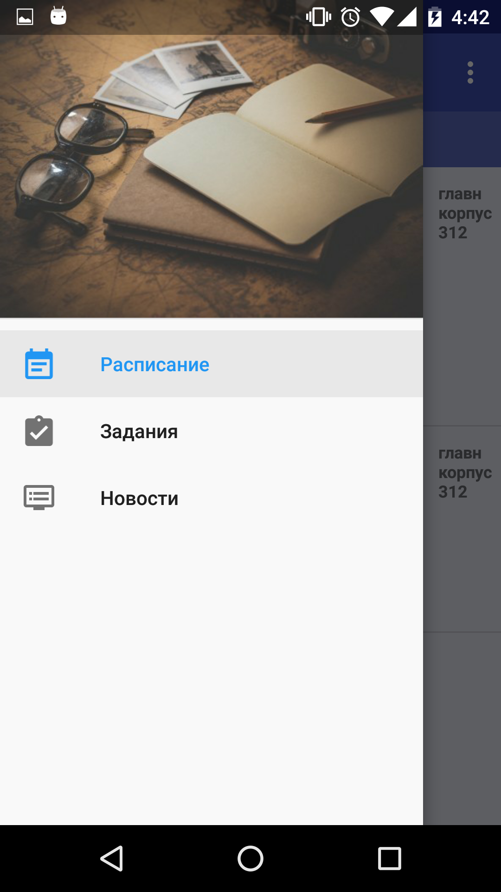
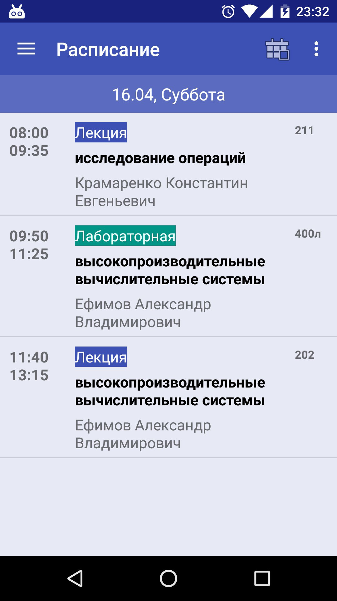
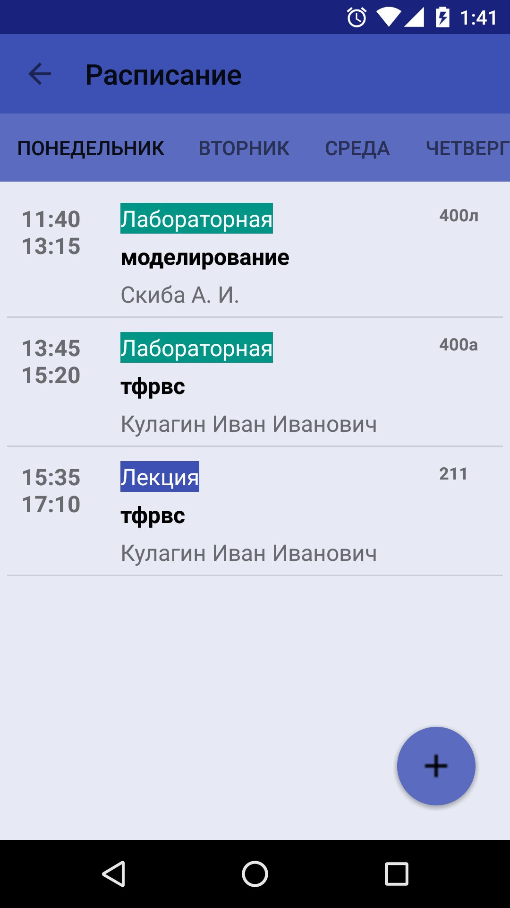
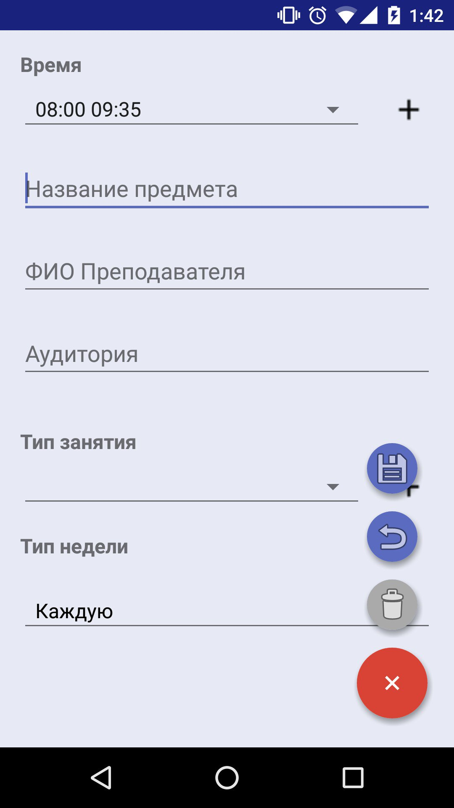
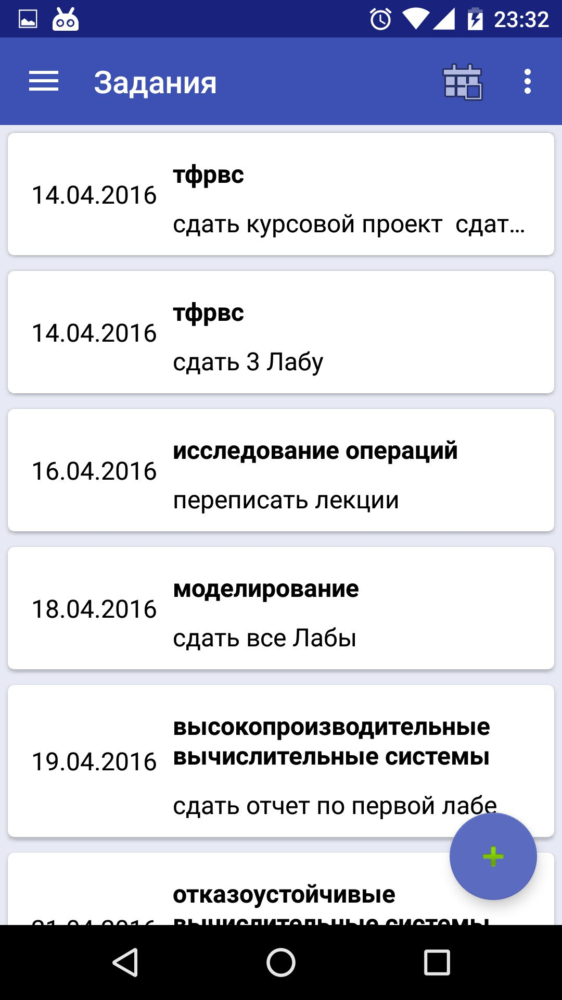
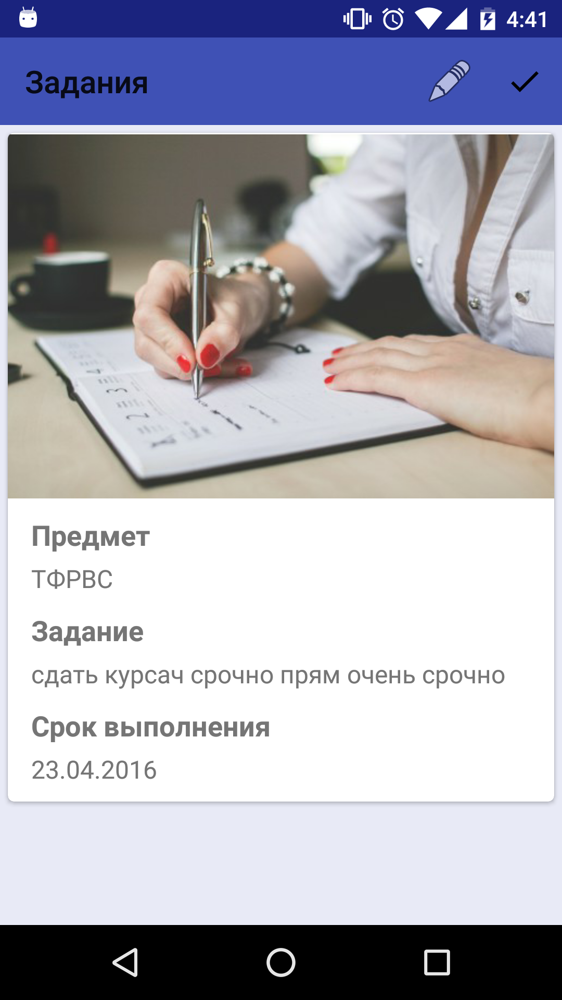
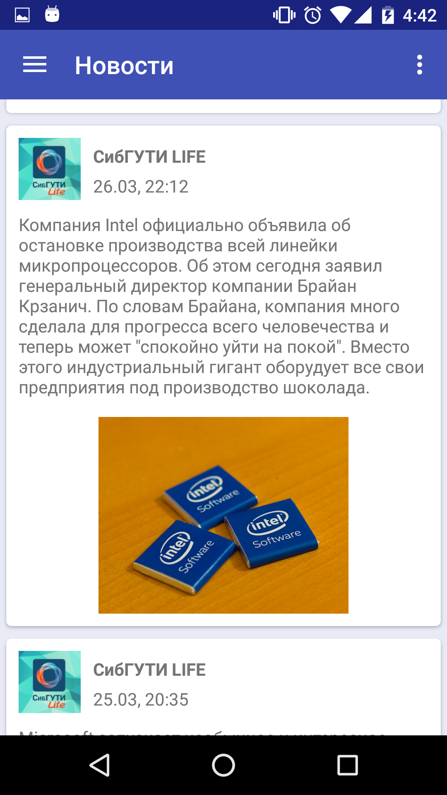

# The application schedule for the University 
######*(Siberian State University of Telecommunications and Informatics)*

The application is built as part of the curriculum of the evening school android developers from the company **Noveo**

> The app is still in development stage
> 

##Available opportunities:
- Add a schedule manually
- View the schedule
- Add tasks
- View and delete tasks
- View news from the social network Vkontakte, group SibSUTI Life

##Example
  
***

#####Add, delete and edit lessons

  
***
#####Add, delete, view and edit tasks

  
***

#####View news

